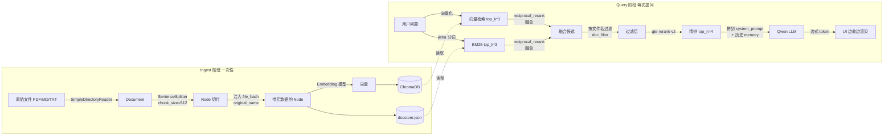

# LlamaIndex RAG 项目学习指南

> 一份按"先看什么、再看什么、为什么这么写"组织的项目导读。

---

## 1. 项目定位

`llamaIndex_rag` 是一个完整可运行的 **企业级 RAG 系统脚手架**，覆盖了从数据摄入到对话交互的全链路。技术选型偏国内能落地：

| 层 | 选型 | 干嘛的 |
|---|---|---|
| LLM | DashScope Qwen (`qwen-plus`) | 生成回答 |
| Embedding | DashScope `text-embedding-v3` 或本地 HF `bge-large-zh-v1.5` | 文本向量化 |
| Rerank | DashScope `gte-rerank-v2` | 二次精排 |
| 向量库 | ChromaDB(本地持久化) | 存 embeddings + metadata |
| 关键词召回 | BM25 + jieba 分词 | 与向量检索做混合 |
| 编排框架 | LlamaIndex 0.12+(用 `Settings` 单例) | 把上面这些拼起来 |
| Web UI | Streamlit | 上传 / 对话 / 会话管理 |
| HTTP API | FastAPI + SSE | 给外部程序调用 |

---

## 2. 目录结构

```
llamaIndex_rag/
├─ .env                       # 真实配置(含 API key,不入库)
├─ .env.example               # 配置模板
├─ requirements.txt
├─ README.md
├─ streamlit_app.py           # Web UI 入口(约 1170 行,最复杂)
│
├─ src/                       # 核心后端
│  ├─ config.py               # ① pydantic-settings 读 .env
│  ├─ settings.py             # ② LlamaIndex 全局 LLM/Embedding 初始化
│  ├─ ingest.py               # ③ 文档 → 切片 → 向量 → Chroma
│  ├─ doc_store.py            # ④ 文档级 CRUD(按 file_hash 查/删)
│  ├─ retriever.py            # ⑤ 向量+BM25 混合检索 + rerank
│  ├─ chat.py                 # ⑥ 多轮对话引擎(含流式、追问、风格)
│  ├─ sessions.py             # ⑦ 对话历史持久化
│  └─ api.py                  # ⑧ FastAPI 路由
│
├─ scripts/
│  ├─ ingest.py               # CLI:全量入库
│  ├─ ask_once.py             # CLI:问一句
│  ├─ run_api.py              # CLI:启 FastAPI
│  └─ diagnose.py             # 自检:embedding/LLM/rerank 是否能调通
│
├─ data/
│  ├─ uploads/                # 用户上传的原始文件
│  └─ chat_history/<sid>.json # 对话历史
│
└─ storage/
   ├─ chroma/                 # ChromaDB 持久化(向量 + metadata)
   └─ docstore/docstore.json  # LlamaIndex 节点存储(BM25 复用)
```

数字 ① ~ ⑧ 就是 **推荐的源码阅读顺序** —— 后面是前面的基础。

---

## 3. 数据流总览

把 RAG 一切都想明白,就一张图:



**关键点**:"向量库" 和 "docstore" 是两份数据 —— Chroma 存向量(向量检索用),`docstore.json` 存原始节点文本(BM25 用)。这是为什么 `ingest.py` 末尾要 `storage_context.persist()`,而不是只写 Chroma。

---

## 4. 模块讲解(按依赖顺序)

### ① `config.py` — 配置中心

用 `pydantic-settings` 把所有可调参数从 `.env` 读进来,做成一个 `Settings` 单例。

```python
class Settings(BaseSettings):
    model_config = SettingsConfigDict(
        env_file=str(PROJECT_ROOT / ".env"),
        env_file_encoding="utf-8",
        extra="ignore",
    )

    dashscope_api_key: str = Field(..., alias="DASHSCOPE_API_KEY")
    llm_model: str = Field("qwen-plus", alias="LLM_MODEL")
    chunk_size: int = Field(512, alias="CHUNK_SIZE")
    vector_top_k: int = Field(5, alias="VECTOR_TOP_K")
    ...
```

**学到什么**:别用 `os.environ.get(...)` 散落在代码各处。集中、有类型校验、首次实例化时校验必填项。`get_settings()` 是单例,启动时自动 `mkdir -p` 各个数据目录。

---

### ② `settings.py` — LlamaIndex 全局初始化

LlamaIndex 0.10+ 抛弃了 `ServiceContext`,改用全局 `Settings` 单例(注意:和我们自己的 `Settings` 同名,是巧合)。这里干三件事:

1. 注册 LLM(`DashScope`)
2. 注册 Embedding(dashscope 在线 / huggingface 本地,工厂模式切换)
3. 注册 NodeParser(`SentenceSplitter`)

**亮点:DashScope SDK 补丁**

```python
_orig_call = Generation.call

def _patched_call(*args, **kwargs):
    msgs = kwargs.get("messages")
    if isinstance(msgs, list):
        for m in msgs:
            if isinstance(m, dict) and "tool_calls" in m and not m["tool_calls"]:
                del m["tool_calls"]
    return _orig_call(*args, **kwargs)

Generation.call = staticmethod(_patched_call)
```

`llama-index-llms-dashscope` 在多轮对话时会给 assistant message 加 `"tool_calls": []`,但 DashScope 服务端拒收空数组,第二轮起就静默返回空。这是个 **典型的"上游 SDK bug,又等不及它修复"的处理范式 —— 猴子补丁 + 详细注释**。值得抄到自己的项目里。

---

### ③ `ingest.py` — 摄入流水线

核心函数是 `build_index_with_progress(file_paths, progress_cb, ...)`,三阶段:

1. **加载文档 + 去重**:调用 `precheck_files()` 算 SHA-1,hash 在 Chroma 已存在就跳过(避免重复入库)
2. **切片 + 注入元数据**:每个 Node 都打上 `file_hash` / `original_name` / `uploaded_at` / `file_size`
3. **Embedding + 写库**:分批生成向量 → `vector_store.add()` 写 Chroma → `docstore.add_documents()` 写 docstore.json

**为什么要切片时手动遍历而不是 `from_documents`?** 因为 (a) 要按节点数量驱动进度条;(b) 要往 metadata 里塞自定义字段。看这段就懂了:

```python
for n in new_nodes:
    n.metadata.update(meta_extra)
    # 把 file_hash / original_name 等也加入 LLM 可见的 metadata key 列表,
    # 防止默认隐藏导致 retriever rerank 拿不到
    for k in ("file_hash", "original_name", "uploaded_at", "file_size"):
        if k in n.excluded_llm_metadata_keys:
            continue
        n.excluded_llm_metadata_keys.append(k)
        n.excluded_embed_metadata_keys.append(k)
```

LlamaIndex 默认会把 metadata 拼到 prompt 里"喂"给 LLM —— 但是 `file_hash` 这种是给业务用的,不该污染 prompt。所以加到 `excluded_llm_metadata_keys`。这是 LlamaIndex 一个不太显眼但很重要的点。

---

### ④ `doc_store.py` — 文档级管理

LlamaIndex 自己的 API 里没有"按某个原始文件删它的所有 chunk"这个能力。所以这一层基于 metadata 自己写:

- `find_by_hash(h)` → 在 Chroma 里 `where={"file_hash": h}` 查
- `delete_by_hash(h)` → 同时删 Chroma + 手动改写 `docstore.json`
- `list_documents()` → 把每个 `file_hash` 聚合成一个 `DocStat`(含节点数、上传时间、大小)

**学到什么**:把 metadata 设计好,向量库就能当"半个数据库"用。

---

### ⑤ `retriever.py` — 混合检索 + rerank(最有意思的一层)

继承 `BaseRetriever` 自定义 `_retrieve` 方法。流程:

```
向量检索 ─┐
          ├─→ QueryFusionRetriever(reciprocal_rerank 融合)─→ 按 doc_filter 过滤 ─→ DashScope rerank ─→ Top-N
BM25     ─┘
```

**几个值得学的设计:**

#### a) `contextvars` 做请求级过滤

```python
_doc_filter_var: contextvars.ContextVar[Optional[Set[str]]] = (
    contextvars.ContextVar("doc_filter", default=None)
)

def set_doc_filter(file_names: Optional[List[str]]) -> contextvars.Token:
    return _doc_filter_var.set(set(file_names) if file_names else None)

def reset_doc_filter(token: contextvars.Token) -> None:
    _doc_filter_var.reset(token)
```

`BaseRetriever._retrieve(query_bundle)` 的签名是固定的,不能加参数。用 `contextvars` 在外层 set、内层 get,签名不变就能传额外信息。**比改签名优雅,而且天然线程安全 / 协程安全。** 这是 Python 3.7+ 里的高级技巧。

#### b) 每路单独捕获异常 + 降级

向量挂了用 BM25 兜,rerank 挂了用融合结果兜。任何一路坏掉系统不死。

#### c) `last_trace` 暴露中间结果

`RetrievalTrace` 记录了向量/BM25/融合/rerank 四阶段每条命中的分数,UI 直接显示给开发者看 —— RAG 调参全靠它。

---

### ⑥ `chat.py` — 对话引擎

基于 `CondensePlusContextChatEngine`:每轮先把对话历史"压缩成"一句独立问题,再去检索,再让 LLM 答。

提供两种调用:
- `chat()` → 同步,一次返完整答案
- `stream_chat()` → 返一个 `ChatStreamHandle`,UI 边消费 `token_iter` 边渲染,结束后调 `finalize()` 拿 citations / trace

**几个亮点:**

1. **流式失败兜底**:DashScope stream 模式偶尔静默返回 0 token,捕获后用非流式 `chat()` 重试一次。
2. **风格切换**:`STYLE_PROMPTS` 字典 + `set_style()` 重建 engine 但保留 memory,用户可以在「简洁/详细/对比表格/步骤化」之间切换。
3. **追问生成 `suggest_followups()`**:用 `LLM.complete()` 让模型按 JSON 输出 3 个候选问题,三层 fallback 解析(JSON → 正则抓 `[...]` → 按行)。**这种"宽容解析 LLM 输出"的写法值得学。**

---

### ⑦ `sessions.py` — 会话持久化

`StoredSession` / `StoredMessage` / `StoredCitation` 三层 dataclass,每个会话一个 `<sid>.json`。功能:

- `list(query)` 关键字搜索 + 按"置顶 → 时间倒序"排序
- `save()` 用 `tmp -> replace` 原子写,避免半写入损坏
- `rename` / `set_pinned` / `import_session` / 导出 Markdown / JSON

**为什么独立一层、不依赖 LlamaIndex?** 因为对话历史是业务数据,要能直接用 JSON 看;和 LLM 编排框架解耦,将来换 LangChain / 自研都能复用。

---

### ⑧ `api.py` — FastAPI 接口

把 `ChatService` / `DocStore` / `SessionStore` 全部 RESTful 化。值得学的两个点:

1. **SSE 流式接口** 用 `StreamingResponse` + 自定义事件(`token` / `done` / `error`),客户端断连自动 graceful shutdown。
2. **`lifespan` 容错**:预热失败(向量库为空)也让服务起来,因为还要让用户走 `/documents/upload` 上传文件。

---

## 5. UI 层 `streamlit_app.py`(最复杂的一个文件)

约 1170 行,但结构清晰:左侧 `st.sidebar.radio` 切换两个页面:

- **📤 文档管理**:上传 → 进度条 → 入库;展示已入库文件 + 节点数;联动删除(文件 + 向量 + docstore)
- **💬 知识问答**:会话管理工具栏 + 历史消息 + chat_input + 流式回答

**值得学的几个 Streamlit 技巧:**

1. **`st.chat_input` 的 sticky bottom**:必须放在脚本根 layer(不能放 columns 里),Streamlit 自动浮在底部。这就是为什么用 `st.sidebar.radio` 而不是 `st.tabs` 切页。
2. **流式渲染 + 中断保留**:先 append 一个 placeholder 字典进 `chat_messages`,每收到 token 同步写 `placeholder["content"]`;用 `try/finally` 保证就算 Streamlit Stop 中断(抛 `RerunException`)也能落盘 partial。
3. **`on_change` / `on_click` 回调**:避免在脚本中直接改 widget state(会抛 `StreamlitAPIException`),所有 widget state 修改都走 callback。
4. **`st.fragment` 一类不用**:Streamlit 1.56 也没用,整体保持单脚本同步执行模型,逻辑反而清晰。

---

## 6. 推荐学习路径

把项目按这个顺序读+动手,效率最高:

### 第 1 天:跑起来 + 摸全貌

1. 看 `README.md` → `requirements.txt` → 装环境
2. 复制 `.env.example` 到 `.env` 填 `DASHSCOPE_API_KEY`
3. 跑 `python -m scripts.diagnose` 确认 LLM/embedding/rerank 都能调通
4. `streamlit run streamlit_app.py` 上传一个 txt 文件、问几个问题,建立感性认识

### 第 2 天:读后端核心三件套

按 ③ → ⑤ → ⑥ 顺序读:

- `ingest.py`:理解"文档 → Node → Chroma"全过程,特别是 metadata 注入
- `retriever.py`:理解三路融合 + rerank 降级,画一遍数据流
- `chat.py`:理解 `CondensePlusContextChatEngine` 怎么把多轮对话变成单轮检索

### 第 3 天:边角细节

- `doc_store.py` + `sessions.py`:CRUD 设计模式,看怎么不依赖 ORM 也写得整洁
- `settings.py` 的 monkey patch:理解为什么、怎么补
- `api.py` 的 SSE 实现

### 第 4 天:UI(如果你做前端)

带着具体问题读 `streamlit_app.py`:

- "中断回答怎么实现的?" → 搜 `placeholder` / `partial`
- "切换会话怎么不报 widget state 异常?" → 搜 `_on_session_selector_change`
- "引用 [1] 怎么变成可点击锚点?" → 搜 `_cite_pattern_replace`

### 第 5 天:动手改一个东西

建议改造(从易到难):

- **简单**:把 `STYLE_PROMPTS` 加一条「学术论文风格」
- **中等**:在 trace 面板里加一个"复制查询条件到剪贴板"按钮
- **进阶**:把 `BM25Retriever` 换成 [SPLADE](https://github.com/naver/splade) 这种学习型稀疏检索
- **架构级**:把 ChromaDB 换成 Qdrant / Milvus,理解 `ChromaVectorStore` 这个适配器在做什么

---

## 7. 这个项目最值得学的"软实力"

不是技术细节,而是几条工程习惯:

1. **每个模块文件顶部都有 docstring 解释"为什么这样设计"** —— 读源码先读 docstring。
2. **关键 hack 都有完整注释**:上游 bug、降级原因、约束条件,一年后回来看也能明白。
3. **每一层都做异常降级**:rerank 挂了走融合,BM25 挂了走向量,stream 挂了走非流式重试。生产系统就该这样。
4. **数据存储分层**:原始文件、向量、节点文本、对话历史各管各的,删一类不影响另一类。
5. **CLI / API / UI 三种入口共用同一套后端**:`scripts/`、`api.py`、`streamlit_app.py` 都只是 `chat.py` / `ingest.py` 的薄壳。

---

## 8. 后续可深入的话题(随时来问)

如果想深入某个具体点,可以围绕这些问题继续学习:

- "我想搞懂 `CondensePlusContextChatEngine` 内部到底怎么压缩问题的"
- "帮我画一下 `_retrieve()` 函数的执行流程图"
- "怎么把 LLM 换成 OpenAI / 本地 Ollama?"
- "Chroma 的 metadata filter `where={...}` 还能怎么用?"
- "`contextvars` vs `threading.local` 区别是啥?"
- "LlamaIndex 的 `Settings` 单例和 ServiceContext 有什么本质区别?"
- "RAG 召回质量差怎么调?有哪些可以加的『救火』模块?"

---

